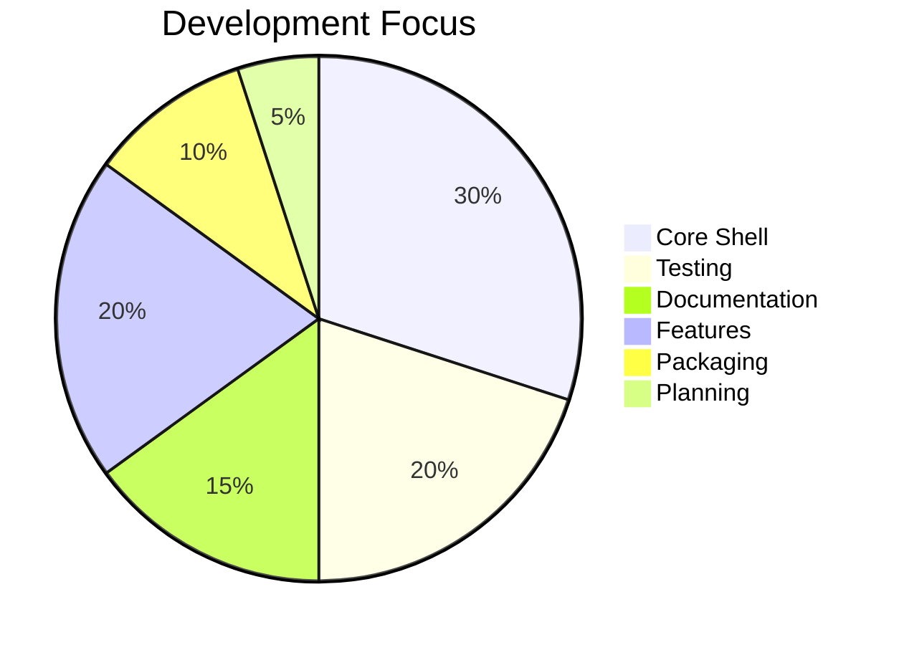

<a>

<p align="center">
  
</p>
</a>

<div align=center>
<a>


</a>
</div>

<div align=center>

<a> █████████████░░░░░░░░ 65% </a>

</div>

# Astra Shell

A modern shell built in Rust for Unix-like systems, with macOS as the primary development platform.

Astra is an interactive command-line environment focused on a clean interface, customization, and a better terminal experience. It combines the power of traditional Unix shells with a modern prompt system, configuration, and extensibility.

Check out our documentation [here!](https://github.com/astra-shell/astra-shell)
>[!WARNING]
> Astra Shell has not gone through extensive testing yet.
> Wait until the first stable release before using it as your primary shell.

## Table of Contents

- Features
- Screenshots
- Installation
- Requirements
- Usage
- Themes
- Why Astra?
- Contributing
- License
- Status

## Features

- Interactive Rust shell
- Configurable prompt engine
- Multiple built-in themes
- Git-aware prompt information
- Command history
- Tab completion
- Alias support
- TOML configuration
- Built-in shell commands
- Modular architecture
- Plugin framework (in development)
- Optional built in AI plugin

## Screenshots

Coming soon.

## Installation

### Requirements

- Rust stable toolchain
- Cargo
- A Unix-like operating system (macOS officially tested)

Install Rust:

```bash
curl --proto '=https' --tlsv1.2 -sSf https://sh.rustup.rs | sh
```

Clone Astra:

```bash
git clone https://github.com/SYOP200/astra-shell
cd astra-shell
```

Build:

```bash
cargo build --release
```

Run:

```bash
./target/release/astra
```

## Usage

Start Astra:

```bash
astra
```

Example:

```text
Crimson

 git: main
◉ finn@MacBook-Air
📁 ~/Developer/astra-shell
14:27
❯
```

Astra executes standard system commands:

```bash
ls
cd Projects
git status
python3 script.py
```

Built-in commands:

```text
cd
pwd
clear
history
exit
```

### Configuration

Astra uses:

```text
~/.astrarc
```

Example:

```toml
[general]
theme = "crimson"

[prompt]
show_git = true
show_directory = true
show_time = true

[aliases]
ll = "ls -la"
```

## Themes

Built-in themes:

- crimson
- midnight
- matrix
- obsidian

Themes control:

- Prompt layout
- Prompt symbol
- Displayed information
- Overall appearance

## Architecture

```text
src/
├── main.rs
├── shell.rs
├── prompt.rs
├── parser.rs
├── executor.rs
├── builtins.rs
├── history.rs
├── config.rs
├── theme.rs
├── git.rs
├── completion.rs
└── aliases.rs
```

Each module has a focused responsibility to keep the project maintainable.

## Supported Languages:
- English
- Deutsch
- español
- 简体中文
- français
  
## Why Astra?

Astra is an experimental shell written in Rust with an emphasis on readability, modularity, and customization. The goal is to provide a clean foundation that can evolve while remaining approachable for contributors.

## Contributing

Contributions are welcome.

```bash
git checkout -b feature-name
git commit -m "Add feature"
```

Then open a pull request.

## License

Astra is licensed under the MIT License.

## Status

Astra is currently in active development.

The core shell, prompt system, configuration loader, history support, themes, and documentation are in place. Current work focuses on command execution, built-in functionality, testing, and release packaging.


